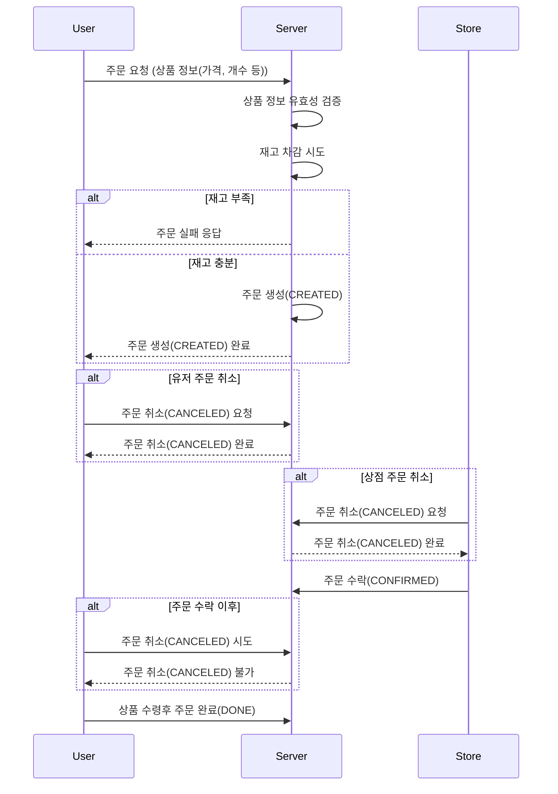

# EatnGo

## EatnGo 용어 정리

### 매장(Store) 관련 용어

|         변수명         |   한글명   | 설명                                                  |
|:-------------------:|:-------:|:----------------------------------------------------|
|        `id`         |  매장 ID  | 매장의 고유 ID                                          |
|   `storeOwnerId`    |  점주 ID  | 해당 매장을 소유한 점주계정 ID (매장:계정 1:1)                     |
|       `name`        |   매장명   | 매장의 이름                                            |
|    `description`    |  매장 설명  | 매장에 대한 설명                                         |
|      `address`      |   주소    | 매장의 주소 정보                                        |
|  `businessNumber`   |  사업자번호  | 매장의 사업자등록 번호                                      |
|   `contactNumber`   |   연락처   | 매장 또는 점주의 전화번호                                    |
|     `imageUrl`      | 대표 이미지  | 매장의 대표 이미지 URL (카드뷰에 표시)                          |
|   `businessHours`   |  영업시간   | 매장의 영업시간 정보                                       |
|      `status`       |  매장 상태  | 매장의 운영 상태 (PENDING, OPEN, CLOSED)                  |
|    `pickUpInfo`     |  픽업 정보  | 픽업 관련 정보                                          |
| `storeCategoryInfo` | 매장 카테고리 | 매장의 카테고리 정보      

### 주소(Address) 관련 용어

|      변수명       |  한글명   | 설명                                                  |
|:--------------:|:------:|:----------------------------------------------------|
| `roadAddress`  | 도로명 주소 | 매장의 도로명 주소                                        |
| `legalAddress` | 법정동 주소 | 매장의 법정동 주소                                        |
| `adminAddress` | 행정동 주소 | 매장의 행정동 주소                                        |
|  `coordinate`  |   좌표   | 매장의 위도, 경도 정보                                     |

### 매장 카테고리(StoreCategoryInfo) 관련 용어

|       변수명       |   한글명   | 설명                                                  |
|:---------------:|:-------:|:----------------------------------------------------|
| `storeCategory` | 매장 카테고리 | 매장의 분류 카테고리 (예: 빵, 카페, 분식 등)                     |
| `foodCategory`  | 음식 카테고리 | 매장의 음식 카테고리 (예: 햄버거, 소금빵, 모카빵 등)                 |

### 매장 구독(StoreSubscription) 관련 용어

|    변수명    |  한글명   | 설명                                                   |
|:---------:|:------:|:-----------------------------------------------------|
|   `id`    | 구독 ID  | 구독 정보의 고유 ID                                         |
| `userId`  | 사용자 ID | 구독한 사용자의 계정 ID                                       |
| `storeId` | 매장 ID  | 구독된 매장의 매장 ID                                        |

### 매장 관련 Value Object 상세 정보

#### `StoreNameVO`
- `value`: `String` - 매장명 (1~50자)

#### `DescriptionVO`
- `value`: `String` - 매장 설명 (최대 500자)

#### `RoadAddressVO`
- `fullAddress`: `String` - 전체 도로명 주소
- `zoneNo`: `String` - 우편번호

#### `LegalAddress`
- `fullAddress`: `String?` - 전체 지번 주소

#### `AdminAddress`
- `fullAddress`: `String?` - 전체 행정동 주소

#### `CoordinateVO`
- `latitude`: `Double` - 위도 (-90.0 ~ 90.0)
- `longitude`: `Double` - 경도 (-180.0 ~ 180.0)

#### `BusinessNumberVO`
- `value`: `String` - 사업자등록번호 (10자리 숫자)

#### `ContactNumberVO`
- `value`: `String` - 전화번호 (예: 02-123-4567 형식)

#### `ImageUrlVO`
- `value`: `String` - 이미지 URL (http/https로 시작)

#### `BusinessHourVO`
- `dayOfWeek`: `DayOfWeek` - 요일 (MONDAY ~ SUNDAY)
- `openTime`: `LocalTime` - 오픈 시간 (HH:mm 형식)
- `closeTime`: `LocalTime` - 종료 시간 (HH:mm 형식, openTime보다 이후여야 함)

#### `PickUpInfoVO`
- `pickupDay`: `StoreEnum.PickupDay` - 픽업 가능 요일 (TODAY, TOMORROW)
- `pickupStartTime`: `LocalTime` - 픽업 시작 시간 (HH:mm 형식)
- `pickupEndTime`: `LocalTime` - 픽업 종료 시간 (HH:mm 형식, startTime보다 이후여야 함)

#### `ReviewInfoVO`
- `ratingAverage`: `Double` - 평균 별점 (0.0 ~ 5.0)
- `ratingCount`: `Int` - 리뷰 개수

#### `StoreCategoryVO`
- `value`: `String` - 매장 카테고리 값 (1~10자)

#### `FoodCategoryVO`
- `value`: `String` - 음식 카테고리 값
# 주문

## 도메인

### 주문(Order)

| 변수명 | 한글명 | 설명 |
| --- | --- | --- |
| id | 식별자 | 주문 식별자 |
| orderNumber | 주문번호 | 주문 번호 ( unique 한 식별자, TsId 로 만들어짐 ) |
| orderItems | 주문상품 목록 | 주문상품 목록 |
| customerId | 손님Id | 손님 식별자 |
| storeId | 상점Id | 상점 식별자 |
| status | 주문상태 | - CREATED - CONFIRMED- CANCELED- DONE |

### 주문상품(OrderItem)

| 변수명 | 한글명 | 설명 |
| --- | --- | --- |
| id | 식별자 | 주문상품 식별자 |
| productId | 상품Id | 상품 식별자 ( 이 때문에 상품Id는 softDelete 하는 것이 좋음) |
| productName | 상품명 | 주문했을 당시의 상품 명을 기록 |
| quantity | 개수 | 주문한 상품 개수 |
| price | 가격 | 주문했을 당시의 상품 가격과 상품 개수를 곱한 값 |

### 주문 상태 내역 (OrderStatusHistory)
| 변수명       | 한글명  | 설명                 |
|-----------|------|--------------------|
| id        | 식별자  | 주문 상태 내역 식별자       |
| orderId   | 주문Id | 주문 식별자             |
| status    | 주문상태 | 이 내역이 기록될 당시 주문 내역 |
| userType  | 유저타입 | 유저타입(상점, 유저)       |
| createdAt | 생성시각 | 해당 내역이 생성된 시각      |

## 이벤트
### 주문 이벤트(OrderEvent)

주문 생성 이벤트 (CreateOrderEvent)
- 상품 (재고 차감)
- 상점 (신규 주문 생성 알람)

주문 수락 이벤트 (ConfirmOrderEvent)
- 유저 (주문 수락 알람) 

주문 취소 이벤트 (CancelOrderEvent)
- 상품 (재고 복원)

주문 완료 이벤트 (DoneOrderEvent)
- 없음

## 흐름

