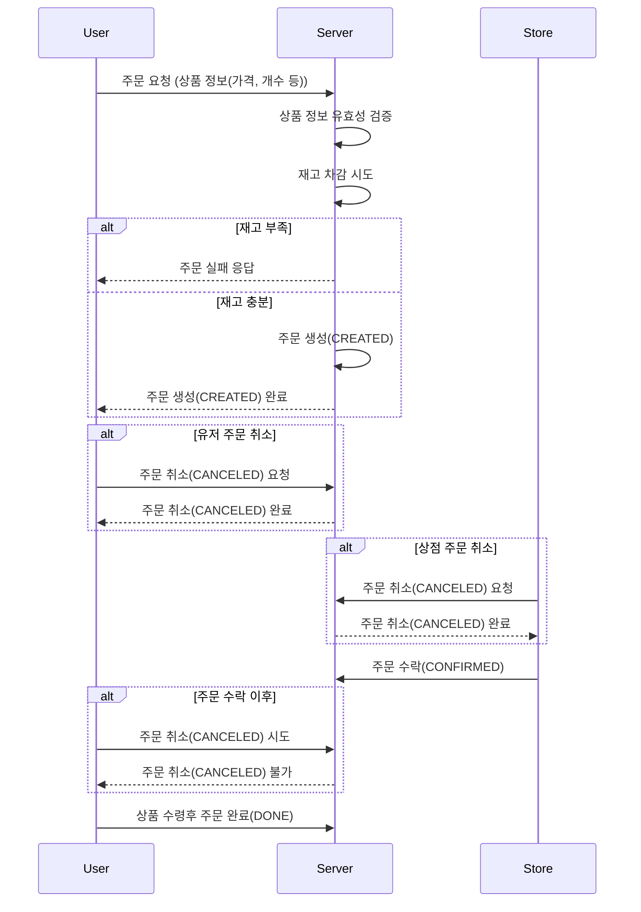

# EatnGo

## EatnGo 용어 정리

# EatnGo

## 공통 시스템 속성 (BaseEntity)

| 한글명   | 영문명         | 설명                                                             |
|-------|-------------|----------------------------------------------------------------|
| 생성 일시 | `createdAt` | 생성 일시 (레코드 최초 생성 시간)                                           |
| 생성자   | `createdBy` | 생성자 ID (Spring Security의 `SecurityContextHolder.principal`) 기준 |
| 수정일시  | `updatedAt` | 마지막 수정 일시                                                      |
| 수정자   | `updatedBy` | 마지막 수정자 ID                                                     |
| 삭제일시  | `deletedAt` | 삭제 일시 (Soft Delete 처리 시 사용)                                    |

---

## 사용자 계정 (UserAccount)

| 한글명 | 영문명        | 설명                     |
|-----|------------|------------------------|
| 이메일 | `email`    | 사용자 이메일 (카카오 필수 동의 항목) |
| 닉네임 | `nickname` | 사용자 닉네임 (카카오 선택 동의 항목) |

---

## 계정 역할 (AccountRole)

| 한글명   | 영문명               | 설명                                                |
|-------|-------------------|---------------------------------------------------|
| 계정 ID | `user_account_id` | 계정 식별자                                            |
| 역할    | `role`            | 계정 권한: `USER`, `CUSTOMER`, `STORE_OWNER`, `ADMIN` |

---

## 계정 인증 정보 (AccountOAuth2)

| 한글명          | 영문명               | 설명                                     |
|--------------|-------------------|----------------------------------------|
| 계정 ID        | `user_account_id` | 계정 식별자                                 |
| 이메일          | `email`           | 이메일 (카카오 필수 동의)                        |
| 닉네임          | `nickname`        | 닉네임 (카카오 선택 동의)                        |
| 인증 제공자       | `provider`        | OAuth2 제공자 (`KAKAO` 등)                 |
| 유저 키         | `userKey`         | 소셜 제공자에서 제공하는 고유 사용자 식별자               |
| OAuth2 인증 토큰 | `accessToken`     | OAuth2 인증 시 발급된 액세스 토큰                 |
| 토큰 만료 일시     | `expireAt`        | 토큰 만료 일시                               |
| 인증 범위        | `scopes`          | OAuth2 인증 범위 (예: 이메일, 닉네임 등 동의 항목 리스트) |

---

## 회원 인증 약관 (AccountOAuth2Term)

| 한글명         | 영문명                      | 설명                |
|-------------|--------------------------|-------------------|
| 계정 인증 정보 ID | `user_account_oauth2_id` | OAuth2 인증 정보의 식별자 |
| 약관 태그       | `tag`                    | 동의 항목의 태그         |
| 약관 동의 일시    | `agreeAt`                | 해당 약관에 동의한 일시     |

---

## 고객 (Customer)

| 한글명   | 영문명               | 설명         |
|-------|-------------------|------------|
| 계정 ID | `user_account_id` | 고객의 계정 식별자 |

---

## 점주 (StoreOwner)

| 한글명   | 영문명               | 설명         |
|-------|-------------------|------------|
| 계정 ID | `user_account_id` | 점주의 계정 식별자 |

### 매장(Store) 관련 용어

|         변수명         |   한글명   | 설명                                |
|:-------------------:|:-------:|:----------------------------------|
|        `id`         |  매장 ID  | 매장의 고유 ID                         |
|   `storeOwnerId`    |  점주 ID  | 해당 매장을 소유한 점주계정 ID (매장:계정 1:1)    |
|       `name`        |   매장명   | 매장의 이름                            |
|    `description`    |  매장 설명  | 매장에 대한 설명                         |
|      `address`      |   주소    | 매장의 주소 정보                         |
|  `businessNumber`   |  사업자번호  | 매장의 사업자등록 번호                      |
|   `contactNumber`   |   연락처   | 매장 또는 점주의 전화번호                    |
|     `imageUrl`      | 대표 이미지  | 매장의 대표 이미지 URL (카드뷰에 표시)          |
|   `businessHours`   |  영업시간   | 매장의 영업시간 정보                       |
|      `status`       |  매장 상태  | 매장의 운영 상태 (PENDING, OPEN, CLOSED) |
|     `pickUpDay`     |  픽업날짜   | 픽업하는 날(TODAY. TOMORROW)           |
| `storeCategoryInfo` | 매장 카테고리 | 매장의 카테고리 정보                       |

### 주소(Address) 관련 용어

|      변수명       |  한글명   | 설명            |
|:--------------:|:------:|:--------------|
| `roadAddress`  | 도로명 주소 | 매장의 도로명 주소    |
| `legalAddress` | 법정동 주소 | 매장의 법정동 주소    |
| `adminAddress` | 행정동 주소 | 매장의 행정동 주소    |
|  `coordinate`  |   좌표   | 매장의 위도, 경도 정보 |

### 매장 카테고리(StoreCategoryInfo) 관련 용어

|       변수명       |   한글명   | 설명                               |
|:---------------:|:-------:|:---------------------------------|
| `storeCategory` | 매장 카테고리 | 매장의 분류 카테고리 (예: 빵, 카페, 분식 등)     |
| `foodCategory`  | 음식 카테고리 | 매장의 음식 카테고리 (예: 햄버거, 소금빵, 모카빵 등) |

### 매장 구독(StoreSubscription) 관련 용어

|    변수명    |  한글명   | 설명             |
|:---------:|:------:|:---------------|
|   `id`    | 구독 ID  | 구독 정보의 고유 ID   |
| `userId`  | 사용자 ID | 구독한 사용자의 계정 ID |
| `storeId` | 매장 ID  | 구독된 매장의 매장 ID  |

### 매장 관련 Value Object 상세 정보

#### `StoreNameVO`

- `value`: `String` - 매장명 (1~50자)

#### `DescriptionVO`

- `value`: `String` - 매장 설명 (최대 500자)

#### `RoadAddressVO`

- `fullAddress`: `String` - 전체 도로명 주소
- `zoneNo`: `String` - 우편번호

#### `LegalAddress`

- `fullAddress`: `String?` - 전체 지번 주소

#### `AdminAddress`

- `fullAddress`: `String?` - 전체 행정동 주소

#### `CoordinateVO`

- `latitude`: `Double` - 위도 (-90.0 ~ 90.0)
- `longitude`: `Double` - 경도 (-180.0 ~ 180.0)

#### `BusinessNumberVO`

- `value`: `String` - 사업자등록번호 (10자리 숫자)

#### `ContactNumberVO`

- `value`: `String` - 전화번호 (예: 02-123-4567 형식)

#### `ImageUrlVO`

- `value`: `String` - 이미지 URL (http/https로 시작)

#### `BusinessHourVO`

- `dayOfWeek`: `DayOfWeek` - 요일 (MONDAY ~ SUNDAY)
- `openTime`: `LocalTime` - 오픈 시간 (HH:mm 형식)
- `closeTime`: `LocalTime` - 종료 시간 (HH:mm 형식, openTime보다 이후여야 함)

#### `PickUpDayVO`

- `pickupDay`: `StoreEnum.PickupDay` - 픽업 가능 요일 (TODAY, TOMORROW)

#### `ReviewInfoVO`

- `ratingAverage`: `Double` - 평균 별점 (0.0 ~ 5.0)
- `ratingCount`: `Int` - 리뷰 개수

#### `StoreCategoryVO`

- `value`: `String` - 매장 카테고리 값 (1~10자)

#### `FoodCategoryVO`

- `value`: `String` - 음식 카테고리 값

# 주문

## 유즈케이스

- 손님은 주문을 생성 할 수 있다.
    - 손님은 현재 보고 있는 상품의 가격, 이름, 설명, 개수를 서버로 전달한다.
    - 서버는 해당 정보를 저장되어있는 정보와 동일한지 확인하고 동일하지 않다면 오류를 발생시킨다.
    - 주문이 생성되면 상점에게 알람이 날아가고 재고를 차감한다.
- 손님은 주문을 취소 할 수 있다.
    - 상점이 주문을 수락하기 전에 취소할 수 있다.
    - 취소하면 재고가 복구된다.
- 상점은 주문을 취소 할 수 있다.
    - 취소하면 재고가 복구된다.
- 상점은 주문을 승인할 수 있다.
    - 승인하면 손님에게 알람이 날아간다.
    - 승인된 주문은 손님이 취소할 수 없다.
- 손님은 주문을 완료 처리할 수 있다.
    - 손님이 상점으로 가서 상품을 받고 주문을 완료 처리할 수 있다.
    - 완료되었음을 상점에게 알려준다.
- 손님은 자신의 최근 주문 이력을 조회할 수 있다.
- 상점은 주문 이력을 필터링하여 조회할 수 있다.
- 상점은 신규 주문이 발생하였을 시 실시간으로 데이터를 조회할 수 있다.

## 도메인

### 주문(Order)

| 변수명         | 한글명     | 설명                                    |
|-------------|---------|---------------------------------------|
| id          | 식별자     | 주문 식별자                                |
| orderNumber | 주문번호    | 주문 번호 ( unique 한 식별자, TsId 로 만들어짐 )   |
| orderItems  | 주문상품 목록 | 주문상품 목록                               |
| customerId  | 손님Id    | 손님 식별자                                |
| storeId     | 상점Id    | 상점 식별자                                |
| status      | 주문상태    | - CREATED - CONFIRMED- CANCELED- DONE |

### 주문상품(OrderItem)

| 변수명                | 한글명  | 설명                                        |
|--------------------|------|-------------------------------------------|
| id                 | 식별자  | 주문상품 식별자                                  |
| productId          | 상품Id | 상품 식별자 ( 이 때문에 상품Id는 softDelete 하는 것이 좋음) |
| productName        | 상품명  | 주문했을 당시의 상품 명을 기록                         |
| productDescription | 상품설명 | 잇고백에 포함될 수 있는 상품 목록                       |
| quantity           | 개수   | 주문한 상품 개수                                 |
| price              | 가격   | 주문했을 당시의 상품 가격과 상품 개수를 곱한 값               |

### 주문 상태 내역 (OrderStatusHistory)

| 변수명       | 한글명  | 설명                 |
|-----------|------|--------------------|
| id        | 식별자  | 주문 상태 내역 식별자       |
| orderId   | 주문Id | 주문 식별자             |
| status    | 주문상태 | 이 내역이 기록될 당시 주문 내역 |
| userType  | 유저타입 | 유저타입(상점, 유저)       |
| createdAt | 생성시각 | 해당 내역이 생성된 시각      |

## 이벤트

### 주문 이벤트(OrderEvent)

주문 생성 이벤트 (CreateOrderEvent)

- 상품 (재고 차감)
- 상점 (신규 주문 생성 알람)

주문 수락 이벤트 (ConfirmOrderEvent)

- 유저 (주문 수락 알람)

주문 취소 이벤트 (CancelOrderEvent)

- 상품 (재고 복원)

주문 완료 이벤트 (DoneOrderEvent)

- 없음

## 흐름

# 리뷰
  
## 유즈케이스
- 주문이 완료 된 후 손님은 리뷰를 작성할 수 있다.
  - 이 때 리뷰 내용과 평점을 남길 수 있다.
  - 주문 한개당 리뷰를 하나만 작성할 수 있다.
- 손님은 상점 별로 리뷰 목록을 조회할 수 있다.

## 도메인

### 리뷰(Review)

| 변수명     | 한글명    | 설명                                    |
|---------|--------|---------------------------------------|
| id      | 식별자    | 리뷰 식별자                                |
| orderId | 주문 식별자 | 리뷰를 작성한 주문 식별자                        |
| score   | 평점     | 0점부터 5점까지 부여가능                        |
| content | 리뷰 내용  | 리뷰 내용                                 |

## Search 관련 용어 정리

|    용어    |     Variable      | 설명                                                   |
|:--------:|:-----------------:|:-----------------------------------------------------|
|    검색    |  `searchFilter`   | 사용자가 입력한 검색어 및 필터 정보                                 |
|  검색할 가게  |   `searchStore`   | MongoDB에 저장된 가게 정보 객체                                |
|  지도 검색   | `searchStoreMap`  | Redis에 캐싱되는 지도 기반 가게 정보                              |
| 위치(위경도)  |   `coordinate`    | 사용자/매장의 위치 정보 (위도, 경도)                               |
|    위도    |    `latitude`     | 위도                                                   |
|    경도    |    `longitude`    | 경도                                                   |
|  검색 쿼리   |   `searchQuery`   | 위치와 필터 등을 포함한 검색 요청 객체                               |
|    분류    |    `category`     | 음식 종류 분류 (예: 한식, 중식 등)                               |
|   영업시간   |  `businessHours`  | 가게의 운영 시간 정보                                         |
|   오픈시간   |    `openTime`     | 가게 오픈 시간                                             |
|   종료시간   |    `closeTime`    | 가게 영업 종료 시간                                          |
|  도로명주소   |   `roadAddress`   | 가게의 도로명 주소 정보                                        |
|  가게 상태   |   `storeStatus`   | 가게의 운영 상태 (예: 영업 중, 준비 중, 휴무 등)                      |
|  박스 좌표   |       `box`       | 지도에서 검색 시 사용하는 영역 단위 (0.005 기준 사각형)                  |
|  좌상단 좌표  |     `topLeft`     | `Box` 내에서 좌측 상단 위경도                                  |
|  우하단 좌표  |   `bottomRight`   | `Box` 내에서 우측 하단 위경도                                  |
| 자동완성 키워드 | `searchRecommend` | 검색어 자동완성에 사용되는 추천 키워드 리스트                            |
|  가게 이름   |    `storeName`    | 가게의 이름                                               |
|  가게 이미지  |   `storeImage`    | S3에 저장될 매장의 대표 이미지                                   |
|  가게 ID   |     `storeId`     | MongoDB에서 가게를 식별하는 고유 ID                             |
|  거리 정보   |   `distanceKm`    | 사용자의 현재 위치와 가게 간의 거리 정보 (km 단위)                      |
|  재고 수량   |      `stock`      | 가게의 재고 수량 정보                                         |
|  픽업 시간   |   `pickupTime`    | 사용자가 검색 필터에서 사용하는 픽업 가능 시간 (예: 11:30분에 픽업 가능한 가게 검색) |

### 상품(Product) 관련 용어

| 한글명        | 영문명             | 설명                                       |
|------------|-----------------|------------------------------------------|
| 상품         | product         | 매장에 등록하는 상품의 단위                          |
| 큰 사이즈 잇고백  | largeEatNGoBag  | 상품의 한 종류 (상품 중 큰 크기의 잇고백)                |
| 중간 사이즈 잇고백 | mediumEatNGoBag | 상품의 한 종류 (상품 중 중간 크기의 잇고백)               |
| 작은 사이즈 잇고백 | smallEatNGoBag  | 상품의 한 종류 (상품 중 작은 크기의  잇고백)              |
| 상품 이름      | name            | 상품의 이름                                   |
| 상품 이미지 주소  | imageUrl        | 상품 이미지의 저장 주소(url)                       |
| 상품 상태      | productStatus   | 상품의 판매 여부를 나타내는 상태(판매중, 판매 중지 상태, 품절 상태) |
| 상품 구성 요소   | foodTypes       | 상품을 이루는 구성 요소                            |
| 음식         | food            | 상품 구성 요소를 이루는 요소                         |
| 음식 이름      | foodName        | 음식의 이름                                   |

### 상품 가격(Product Price) 관련 용어

| 한글명    | 영문명           | 설명                     |
|--------|---------------|------------------------|
| 상품 정상가 | originalPrice | 상품의 초기 가격              |
| 상품 할인가 | finalPrice    | 상품 정상가에 할인율이 적용된 최종 가격 |
| 할인율    | discountRate  | 상품 정상가에 적용될 할인율        |

### 상품 재고(Product Inventory) 관련 용어

| 한글명    | 영문명      | 설명                    |
|--------|----------|-----------------------|
| 상품 수량  | quantity | 점주가 수동으로 설정한 판매 가능 수량 |
| 상품 재고량 | stock    | 현재 실시간 남은 재고          |
